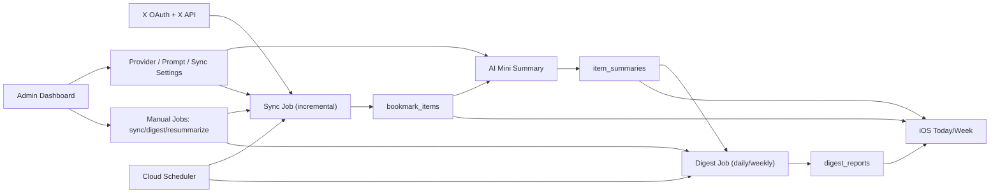
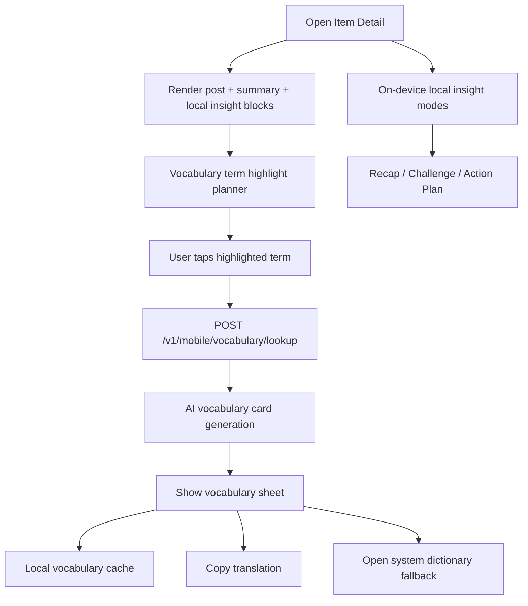
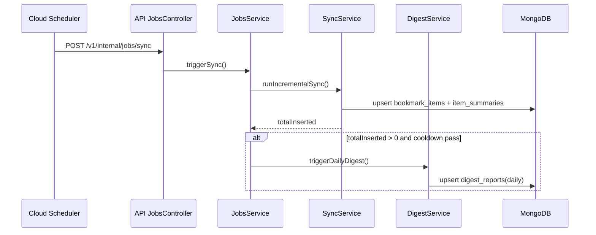
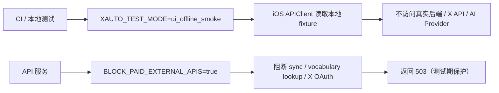
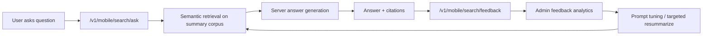

# XAuto 业务全景图 V2（2026-02-24，最新代码基线）

本文档用于沉淀当前系统的业务全景，避免后续迭代时遗忘关键链路。

## 1）系统总览

## 2）当前核心业务闭环

### 2.1 内容采集闭环

1. Sync 从 X 拉取最新书签。
2. 新条目写入 `bookmark_items`。
3. 每条新内容生成结构化摘要，写入 `item_summaries`。

### 2.2 Digest 闭环

1. 日/周 Digest 读取摘要并生成 `digest_reports`。
2. iOS Today/Week 页面消费 digest 与条目数据。
3. 当 sync 插入新内容时，可自动触发 daily digest（带冷却保护）。

### 2.3 管理控制闭环（Admin）

1. Admin 可更新 provider/prompt/sync 策略。
2. Admin 可手动运行 `sync`、`digest_daily`、`digest_weekly`、`resummarize`。
3. 策略变更可即时影响运行时行为。

## 3）Detail 智能能力流程（已上线）

## 4）运行时触发时序

## 4.1）测试模式与外部调用护栏

## 5）核心数据真相表

1. `bookmark_items`：来自 X 的原始书签内容。
2. `item_summaries`：每条 tweet 的结构化摘要与分析结果。
3. `digest_reports`：日/周聚合结果，供 App 多页面消费。
4. `sync_states`：oauth 状态、预算使用、调度运行状态。
5. `job_runs`：任务执行日志，用于运维追踪。

## 6）V2 下一阶段业务图（规划中，未上线）

## 7）5 行速记

1. XAuto 仍是单用户架构，主链路是 bookmark -> summary -> digest。
2. Detail 页面已从阅读页升级为主动研究页。
3. 查词能力是服务端生成词卡 + 本地缓存 + 系统词典兜底，词汇规划支持 Foundation Models。
4. 测试链路有双护栏：`ui_offline_smoke`（客户端）+ `BLOCK_PAID_EXTERNAL_APIS`（服务端）。
5. V2 下一步是检索问答 + 反馈闭环，持续提升质量。
